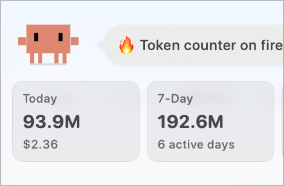
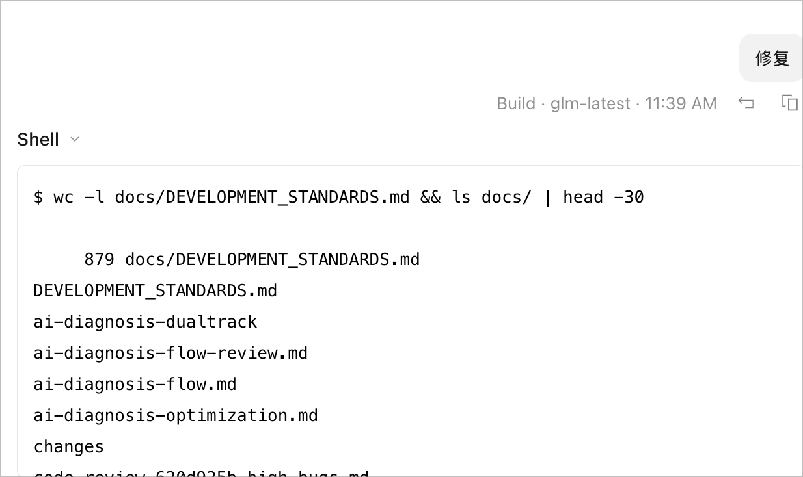
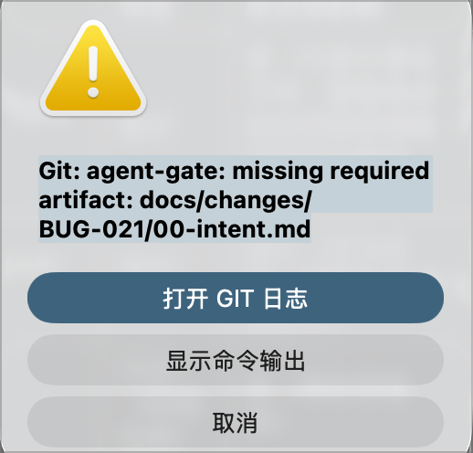
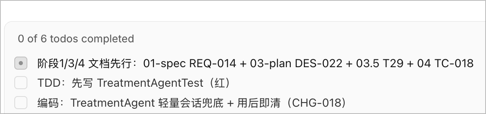
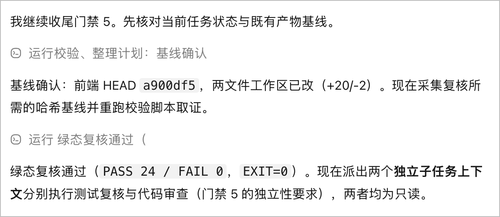

<!-- markdownlint-disable MD033 MD041 MD013 -->
<div align="center">

# dev-standards-bootstrap

### One-command AI Agent Development Governance & Quality Gate System for Any Repository

[](LICENSE)
[](https://github.com/geekma/dev-standards-bootstrap/actions/workflows/ci.yml)
[](resources/DEVELOPMENT_STANDARDS.md)
[](resources/AGENTS.md)
[](../../pulls)

[English](README.md) | [中文](README.zh-CN.md) | [Changelog](resources/STANDARDS_CHANGELOG.md)

</div>

**In short** — `dev-standards-bootstrap` is a **Claude Code skill** (and a plain git repo, installable into any coding agent) that injects **development governance** into any repository: an `AGENTS.md` entry point every coding agent reads first, five mandatory **quality gates** (doc-first, test-first, evidence, traceability, independent verification), risk-classified **change management**, and Git/CI enforcement — installed once, kept current by the upgrade chain.

| | |
|---|---|
| **Register the skill (one time)** | `npx skills add geekma/dev-standards-bootstrap -g` — or pick any route in [Step 1](#step-1--register-the-skill-with-your-ai-client-one-time) |
| **Initialize any repo** | say: *"Use dev-standards-bootstrap to initialize this repo."* |

---

## About

**dev-standards-bootstrap** is a reusable AI agent skill: one sentence injects a battle-tested development-governance system into any repository. It was extracted from a production codebase where agents wrote hundreds of millions of tokens a day — and packages the loop that kept that output shippable: docs before code, tests before features, evidence before "done", independent review before merge.

`AGENTS.md` is the context layer every coding agent reads first. An optional deterministic gate (`agent-gate`) blocks non-compliant writes through client hooks and Git hooks, and CI is the final cross-client arbiter. Install once in a repo, then start every future change by just telling your agent what you want — the process runs itself.

> **This README is a reference manual.** Every command in it is invoked *automatically* by the skill, the Git hooks, or CI at the right moment. Running them by hand is always optional.

## Why

The design is measured, not hypothetical. A CIKM '26 study of production agent memory ([arXiv:2608.22752](https://arxiv.org/abs/2608.22752)) shows `/compact` retains only **53% of safety rules after one round, 10% after five**; the [AI-Native SDLC Playbook](https://claude.com/blog/the-ai-native-sdlc-playbook) documents intent drift and incidents that never feed back. The answer is architectural: **never trust agent memory or self-reports** — governance state lives on disk as versioned artifacts, a dependency-free gate reads the filesystem (not the conversation) at every write, CI is the final arbiter, and the governance package tests itself (see [Key Features](#key-features)).

The failure-diagnosis side is grounded the same way. AgentRx ([arXiv:2602.02475](https://arxiv.org/abs/2602.02475)) shows root-cause attribution stays reliable only when causes go through **mutually-exclusive categories with disambiguation checklists and evidence-cited judgments**. This project folds both into its bug process: root causes anchor at the **earliest unrecovered failure point**, and every gate/audit checker follows a guard→assertion design rule.

Two field notes from the production repository this standard was extracted from:

<p align="center">
  
  <br>
  <sub><b>Field note 1 — code is not the bottleneck.</b> Real token-counter capture: 93.9M tokens in a single day for $2.36, 192.6M across seven days. Output is now measured in hundreds of millions; what breaks is the process wrapped around it.</sub>
</p>

<p align="center">
  
  <br>
  <sub><b>Field note 2 — the standard lives on disk, not in context.</b> The agent's first move on a task is <code>wc -l docs/DEVELOPMENT_STANDARDS.md</code> and <code>ls docs/</code>: it locates the standard as a file it must read, rather than a rule it happens to remember from a conversation that may already be compacted.</sub>
</p>

## Measured Impact

Not theory — a three-way contribution analysis measured on 11 real working sessions (session-DB data cross-checked against git history and governance artifacts; [full analysis](CAPABILITY-COMPARISON.md)):

| Dimension | Model (LLM) | Agent Harness | **dev-standards-bootstrap** |
|---|---|---|---|
| Average contribution across 20 SDLC stages | 36% | 17% | **44%** |
| Strongest stages | Coding 70% | Test execution 70% | **Knowledge retention 70%** |
| Without it, what survives | — | — | Coding/testing keep 85–95%; **retention, cross-session handoff, compliance audit, change intent drop to 25–40%** |
| Paired-config attainment (with vs without) | — | — | **~59% → 100% (≈41 points higher)** |

**What this buys you:**

- **Variance compression, not cleverness.** Governance does not make the model smarter — it nails down "smart but amnesiac, locally strong but globally weak, accurate once but unreproducible" with machine enforcement, memory, and independence. Without it, delivery quality is a dice roll: real samples include six consecutive fixes to the same function and a family of fabricated test-assertion values.
- **Organizational memory is where the value concentrates.** The moment a session compacts or ends, an ungoverned agent restarts from amnesia; here, state lives in the 12-volume master set and disk artifacts.
- **The tax is measured and being cut.** The governance machinery costs ~25% of tool calls and a resident context base — and 97.5%+ of token spend is cache-read prefill from un-switched sessions. v3.38/v3.39 turned session discipline into machine enforcement (water-level gate, exploration-budget yellow light, review-input contract) targeting exactly that: **~90% attainment at a 30–50% cost reduction** — governance-grade quality at near-ungoverned cost.

## Key Features

| Feature | Description |
|---|---|
| **5 Quality Gates + Two-Layer Acceptance** | Doc-First, Test-First, Evidence, Traceability, Independent Verification — non-bypassable; every stage passes machine-verifiable A-layer markers plus independent-role B-layer judgment (§2.5) |
| **Risk Classification × Role Independence** | L0–L3 matrix drives independence: separate execution entities, L2/L3 distinct platform/model vendors, L3 needs human Release Owner approval (§0.5) |
| **Stage-Gated Expert Review (9 experts, §2.2)** | Business/Industry/Tech/Architecture/PM/Security/Performance/Test/Acceptance experts as refined subjects of existing roles; PMP-aligned per-stage review matrix, context-grounding contract (a template review without project evidence is rejected), session-cost guardrails |
| **RTVM Traceability + One Change, One Document Set (一次变更一组文档)** | REQ→DES→TASK→TC full-chain matrix; every change opens a fresh `docs/changes/<new-id>/` group meeting the **eight-category** minimum (§1.1), every defect a fresh six-file bug group |
| **10-Stage Lifecycle + AI Anti-Skip Rules** | ReAct (Thought→Action→Observation) on every step; anti-skip rules ban summary-style "done", silent downgrades, premature completion (§2.16) |
| **Test Coverage Standard (11 dimensions)** | Per-dimension design or explicit N/A; branch coverage ≥60% (L2+); LLM eval-set regression; **business-scenario coverage ≥80%** (SC-xxx, L3 ≥90%) |
| **Methodology Selection Layer (M0–M3)** | `METHODOLOGY.md` answers "which methodologies are allowed / forbidden"; `methodologies/` provide per-item engineering rationale (weak-typing ban, LLM I/O schema separation, state-trigger-audit) |
| **Bug Fix Log + Same-Family Scan + Root-Cause Classification** | Repo-level append-only `bugfix-log.md` index; root-cause tables carry a **same-family** scan row and a mutually-exclusive classification anchored at the earliest unrecovered failure point (AgentRx-derived; §2.5 Stage 6) — fix without family scan is rejected |
| **Deterministic Gate + Pipeline Automation** | One dependency-free validator shared by write-time hooks, Git hooks, and CI; spec merge auto-dispatches skeletons, changelog merge auto-opens a release checklist, incidents auto-create `BUG-<ts>` intent PRs; autonomy capped at A2 (§2.17) |
| **Golden-Case Self-Tests** | `tests/run-tests.sh` regression-tests the gate and the installer (474 golden-case assertions) in throwaway git repos — bash + git only (§2.17.4) |

`agent-gate metrics` emits read-only JSON Lines pipeline metrics from git history — observation only, never a substitute for DoD (§2.17.5). Specialized standards cover deployment/config/DB changes, AI/LLM pipelines, test data isolation, emergency hotfixes, release, monitoring, and supply chain (§2.6–§2.13). The single version history is [`resources/STANDARDS_CHANGELOG.md`](resources/STANDARDS_CHANGELOG.md) (shipped to target repos, machine-pinned by audit G1).

## Supported AI Coding Tools

`AGENTS.md` is a context mechanism, not an enforcement mechanism; support varies by client. Natively reads `AGENTS.md`: **Claude Code, Cursor, Codex, Windsurf, Gemini CLI, Antigravity, Qoder, Trae, OpenCode**. Clients without a known hook schema get no fabricated config — their enforcement path is Git hooks + CI, which validate the repository rather than the editor. The final cross-client control is protected branches plus required CI checks.

## Quick Start

### Step 1 — Register the skill with your AI client (one time)

The "one sentence" in Step 2 needs your agent to know this skill first. Pick **any one** route (A/B/D verified end-to-end; C is plain English for your agent — nothing to install):

**A. Universal skill store** — works today, in any repo, for every supported client:

```bash
npx skills add geekma/dev-standards-bootstrap -g
```

**B. Claude Code plugin** — marketplace-managed install and updates:

```bash
claude plugin marketplace add geekma/dev-standards-bootstrap
claude plugin install dev-standards-bootstrap@geekma-dev-standards
```

**C. Just tell your agent** (no command line at all):

> "Install the dev-standards-bootstrap skill from https://github.com/geekma/dev-standards-bootstrap into your skill directory (clone the repo, then link its `SKILL.md` + `resources/` + `scripts/`), then reload your skills."

**D. The repo's own installer** — take the [one command](#installation--upgrades) and append `--as-skill claude`: it symlinks into `~/.claude/skills` (semantics and other clients in [`--as-skill` details](#--as-skill-details-route-d-in-quick-start)).

Reload your client afterwards (`/reload-skills` in Claude Code, or restart the session).

### Step 2 — Initialize a repository (one sentence)

Open your AI coding tool in the target repository and say:

> "Use dev-standards-bootstrap to initialize this repo."

That's it. The agent detects existing files (never overwrites silently — it diffs first and asks), runs the installer, wires the hooks, and reports what remains (one platform-side step, [below](#what-runs-automatically-and-what-stays-manual)). Upgrading later is the same sentence — the skill detects the version diff and upgrades.

**Skip skill registration entirely?** Run the [one command](#installation--upgrades) exactly as written there (no extra flag) — it installs governance straight into the repository, agent-agnostic (the `AGENTS.md` context layer is natively read by every supported tool), and auto-becomes an upgrade if the target is already governed.

After either path there is nothing left to wire by hand:

<p align="center">
  
  <br>
  <sub>Filing a change is the agent's job, not yours: the agent writes CHG-044's full artifact set (intent → governance → spec → impact analysis → plan → tasks → test scripts) plus the defect document groups for BUG-016/BUG-017 — every file before the first line of source code.</sub>
</p>

## Installation & Upgrades

**One command (install or upgrade, auto-detected):**

```bash
curl -fsSL https://raw.githubusercontent.com/geekma/dev-standards-bootstrap/main/scripts/install.sh | bash -s -- .
```

- Default target is the current directory; pass a path as the first argument instead.
- The skill checkout is kept at `~/.dev-standards-bootstrap/dev-standards-bootstrap` (override with `--skill-dir <path>`); an existing checkout is reused and fast-forward pulled — **local changes there are never overwritten** (the command refuses and tells you).
- Already-governed target → automatic `--upgrade`: governance-owned files (standards, templates, scripts, hooks, workflows, tests) move to the carried version while **live records stay untouched** (`bugfix-log.md`, delivery summary, 06.5 records, your `.agent-governance.yml`). Commit the target repo first so git history preserves any customization.
- Offline / pinned installs: `--from <local-checkout>`, `--repo <url>`, `--ref <branch-or-tag>`.
- Selective layers (`--layer core|claude|ci|guard|pipeline`) and custom directory roots (`--docs-dir`, `--scripts-dir`, `--tests-dir`, `--githooks-dir`) pass through to the installer. Omit them for the full `--all` install with default roots.
- The target should be a git repository: hook wiring (`core.hooksPath`) requires `.git/` — a bare directory gets the files but no Git-hook enforcement (CI still applies once connected).
- Version check without side effects: `--check` compares carried / upstream / installed versions and exits 1 on drift (CI-friendly).

### `--as-skill` details (route D in Quick Start)

Route D symlinks the checkout into the client's skill directory — same [one command](#installation--upgrades), different argument:

- `--as-skill opencode` → symlink into `~/.config/opencode/skills/`
- `--as-skill all` → both clients
- `--as-skill ~/.agents/skills/dev-standards-bootstrap` → any other client, destination directory given directly

Registration is a **symlink** to the checkout (zero copies — self-updates flow through), fail-closed (an existing non-symlink destination is never touched; `--force` only retargets a symlink or replaces an **empty** directory), mutually exclusive with `--install`/`--upgrade`/`--check`/`--layer` (a combined call is a usage error, exit 2), and independent from governing a repository — both paths compose. Reload afterwards (`/reload-skills` in Claude Code, or restart the session).

**Manual equivalent (two commands, if you prefer):**

```bash
git clone https://github.com/geekma/dev-standards-bootstrap.git
bash dev-standards-bootstrap/scripts/bootstrap.sh --all <target-repo>
```

**Checking your version**: the carried standards version is written into `SKILL.md` in three places — frontmatter `version:`, the tail of the `description`, and a banner right under the title — so it is visible in the skill list and again whenever the skill loads. Compare it with the `Standards Version` badge at the top of this README, or run `bash <skill-dir>/scripts/bootstrap.sh --check <target>`.

**Custom directory roots**: the defaults are `docs/`, `scripts/`, `tests/`, `.githooks/` (plus `.github/`, whose location the platform mandates and which is therefore not movable). **Only directory roots are configurable**: `AGENTS.md`, the gate filename, the fourteen change artifacts, the six defect artifacts and the required-check name are cross-repo contracts — making them configurable would break comparison and migration.

## What Runs Automatically (and What Stays Manual)

After install, enforcement is event-driven — **you never run the gate yourself**:

| Event | What happens automatically |
|---|---|
| Agent is about to write source code | Client pre-write hook validates the active change's artifacts and governance state |
| You (or the agent) commit | `pre-commit`/`commit-msg` hooks verify staged artifacts and change attribution; a code commit without a change id is rejected |
| A turn ends after source edits | The stop hook requires the coding record (with script-stamped provenance), test evidence, and a changelog with ReAct Observation records |
| A session starts / goes idle | Session gate runs the consistency audit at start and a stop-equivalent check at idle — stale red lights become visible in-session (v3.28.0); a red light also prints the defect-signal interactive options (scaffold / register FU / ignore with a 09 justification, v3.43.0) |
| A PR opens | CI re-runs the artifact checks **and the project's real verification command**, then requires the `agent-governance` check |
| `01-spec.md` merges to main | A scaffold branch with `02`/`03`/`03.5`/`04` skeleton PRs is created (artifact pipeline) |
| `09-changelog.md` merges to main | A release-checklist issue is opened automatically |
| A production incident fires | `repository_dispatch type=incident` creates a `BUG-<UTC-timestamp>` intent skeleton PR — every incident re-enters the pipeline as recorded intent |
| A main-branch test run fails | `regression-to-bug` workflow calls `scripts/bug-autointent`: a **full six-file defect skeleton** (flat daily batch, metadata pre-filled) is scaffolded with **fingerprint rate-limiting** — the same failing set inside the window (default 24h, env-overridable) only appends a reproduction line instead of a new group (v3.43.0) |

Command reference (invoked by the above; manual runs are for debugging):

| Command | Purpose |
|---|---|
| `begin <change-id>` / `end` | Activate or clear the active change; requires the seven change artifacts and validates governance state (risk level, distinct execution owners; L3 additionally the three `release_authorized_by`-family authorization fields) plus A-layer content markers |
| `--stage pre-write` | Validates the active change before an agent writes source code; fails closed if the target path cannot be parsed from hook input |
| `--stage staged` | Staged source changes must ship with matching change artifacts, otherwise the commit is rejected |
| `--stage commit-msg <msgfile>` | Attribution gate: a code-bearing commit must reference a valid change id (merge / revert / docs-only exempt) |
| `--stage stop` | Ending a turn after source edits requires `04.5-coding-record.md`, `05-test-results.md`, `09-changelog.md` (with ReAct Observation records), plus a passing verification command (L0: 04.5/05 may be §1.1 single-line declarations, v3.44.0); changelog REQ ids must be backfilled in `01.5-rtvm-matrix.md` (Gate 4 closure) |
| `--stage ci [--base <ref>]` | Rechecks the branch/PR diff and runs the real verification command |
| `metrics` | Read-only pipeline metrics as JSON Lines — observations only; aggregates the gate-friction ledger (die codes → counts, v3.43.0) |

**File provenance**: the coding record must carry a `<!-- provenance -->` block produced by `scripts/stamp-provenance.sh <change-id>` — author, committer, commit, host, platform and UTC time are read from the running environment, so they cannot be typed by hand. `--all` stamps every `*.md` artifact of the change directory (the governance JSON is deliberately excluded); since v3.41.0 the pre-commit hook runs it automatically, and v3.42.0 adds `--trace` — the changelog's §4 traceability ids are derived from the `01.5-rtvm-matrix.md` instead of hand-typed. The gate checks block shape and producer; truthfulness of `author` itself is *not* machine-verifiable, and the design says so. No retroactive stamping: history is never back-filled, because back-filling would forge `generated_at` — the very thing the block exists to prevent.

**Verification command auto-detection**: at bootstrap, the real build/test command is detected from the project layout (package.json / Makefile / pom.xml / go.mod / pyproject / Cargo) and prefilled into `.agent-governance.yml` — edit it there, or override with `AGENT_GUARD_VERIFY_COMMAND` (highest priority). A yml verification command is **not executed while the file itself is part of the pending change** (anti-tamper — a PR cannot inject commands into the reviewer's hook); commit it first, or use the env var.

**The one manual step (platform-side, cannot be done by files)**: mark the `agent-governance` workflow as a **required branch-protection check** (Settings → Branches, or via `gh api`). State files and checkboxes are declarations, not proof: CI re-runs the real command and is mandatory for enforcement.

Screenshots — the gate doing its job with zero manual steps:

<p align="center">
  
  <br>
  <sub>The minimum artifact set of a new change staged as new files — <code>begin</code> refuses to activate the gate without them.</sub>
</p>

<p align="center">
  
  <br>
  <sub>agent-gate blocking a non-compliant source commit inside the IDE: no artifacts under <code>docs/changes/&lt;change-id&gt;/</code>, no commit — and the enforcement is not tied to any single editor.</sub>
</p>

<p align="center">
  
  <br>
  <sub>The same gate on the defect path: a commit missing <code>docs/changes/BUG-021/00-intent.md</code> is rejected before it ever reaches the branch.</sub>
</p>

## The Five Quality Gates

A change passing through the gates accumulates its full artifact chain, from `01-spec.md` all the way to `09-changelog.md`:

```
[ Gate 1: Doc-First ]      Requirements/design must exist before any code change
        │
        ▼
[ Gate 2: Test-First ]     Test cases (TDD red-green) must exist before implementation
        │
        ▼
[ Gate 3: Evidence ]       Real test output required — no verbal claims of "done"
        │
        ▼
[ Gate 4: Traceability ]   RTVM must be closed: REQ ↔ DES ↔ CODE ↔ TC
        │
        ▼
[ Gate 5: Independent ]    Test & review by different agents/humans; high-risk needs human approval
```

Any change that fails any gate is **blocked from merge to main**.

<p align="center">
  
  <br>
  <sub>One change's full artifact chain, <code>01-spec.md</code> → <code>09-changelog.md</code>. Every stage ends by committing a version-controlled artifact; the next stage begins by reading it — the commit chain itself is the audit trail.</sub>
</p>

<p align="center">
  
  <br>
  <sub>The same chain seen from inside the AI client: a todo list whose order is pinned by the standard — docs first, then the failing test (red), then code — and every item carries its REQ/DES/TASK/TC/CHG traceability id.</sub>
</p>

### Evidence & Traceability in Practice

<p align="center">
  
  <br>
  <sub>Gate 4's RTVM matrix: every REQ row must resolve to DES / TASK / TC and to verification evidence — an unclosed row blocks the merge.</sub>
</p>

<p align="center">
  
  <br>
  <sub>Gate 3 / §2.16.3 in practice: the DoD is closed item by item with each gate's evidence cited inline. A single line saying "completed per the standard" is rejected — the checklist is the deliverable.</sub>
</p>

### Gate 5 in Practice: Independence Is Dispatched, Not Declared

<p align="center">
  
  <br>
  <sub>Gate 5 starts from real evidence, not a claim: green recheck (PASS 24 / FAIL 0, EXIT=0) plus a frozen baseline hash, then two <b>read-only</b> sub-tasks are dispatched — one for test recheck, one for code review.</sub>
</p>

<p align="center">
  
  <br>
  <sub>Independence is dispatched, not declared: separate sub-tasks for independent test recheck and independent code review — and the review comes back <b>rejected</b> with a blocking finding, which is the system working.</sub>
</p>

<p align="center">
  
  <br>
  <sub>The rework is then verified by a <b>new</b> independent reviewer: the author cannot self-certify, so "fixed" requires evidence produced after the fix.</sub>
</p>

## Risk Classification Matrix

| Level | Criteria | Independence | Cross-Platform | Human Approval |
|---|---|---|---|---|
| **L0** Very Low | No logic change (docs, comments, formatting) | Roles may merge | Not required | No |
| **L1** Low | Non-core modules, no external interfaces | Separate sub-tasks | Not required | No |
| **L2** Medium (default) | Core business logic, P0/P1 priority | Separate execution entities | Recommended | No |
| **L3** High | Sensitive personal data (PII), auth, prod DB, AI/Prompt, breaking API changes, P0 hotfix | Mandatory cross-platform/cross-model | **Mandatory** (≥2 model vendors) | **Mandatory** |

## Governance Details

- **Execution-side token discipline (v3.24.0/v3.25.0)**: the shipped `AGENTS.md` carries an **8-rule** "Agent execution resource discipline" section (piped filtering / single-pass grep / locate-then-window reads / exploration delegated to read-only subagents / no-match ≠ pass / parallel batch writes / targeted verification / stateful mock isolation); §2.9.6 session-context discipline (one topic per session, handoff beyond 50 turns or on topic switch); §2.5 minimal-expression artifact shapes with a ≤40-line soft cap — targeting cache_read (= context level × turns).
- **Same-day change batches (v3.18.0; defaulted in v3.24.0)**: several **L0/L1** changes from the **same day** default to sharing one `<docs>/changes/BATCH-YYYYMMDD/` directory instead of one directory each. Only the directory is relaxed — artifact filenames are unchanged, bundled changes are told apart by a `## <change-id>` section anchor, and the batch's change set is read from the authoritative roster in `00-governance.json` (never inferred from headings). The risk ceiling is not relaxed: **L2/L3 must live in their own directory**, and the gate refuses an L2/L3 record found inside a batch (per the governance roster).
- **Defect groups join daily batches by default (v3.35.0, flat since v3.36.0)**: same-day defects share one flat `docs/bugs/BATCH-YYYYMMDD/` directory — six files named exactly as before, told apart by `## BUG-xxx` section anchors, same-day appends land in the same files (per-defect subdirectories remain a legal legacy form). The append-only `docs/bugfix-log.md` index (one dated row per bug) stays the day-level retrieval layer, and a defect's change-track entry (`BUG-*`) may still join a change batch like any other change.
- **Methodology selection (M0–M3)**: `docs/METHODOLOGY.md` is the sole authority for which methodologies are allowed at which level; `docs/methodologies/development.md`, `docs/methodologies/data-structures.md`, `docs/methodologies/state-trigger-audit.md`, `docs/methodologies/expert-capabilities.md` and `docs/methodologies/project-masters.md` carry the per-item engineering rationale (SOLID/DRY applicability, weak-typing ban, implicit state/trigger-link three-way traversal, expert theory toolboxes).
- **Self-evolution**: skills derived from this one (declaring `derived_from: dev-standards-bootstrap`) live and evolve independently, and every installer/upgrade write path skips them; `--force` does not override that. `bash scripts/bootstrap.sh --derived-report` lists them.
- **Cross-document consistency audit**: `bash tests/audit-docs-consistency.sh` (G1 version chain / G2 numbering continuity / G3 archive sync / G4 bugfix cross-registration / G5 RTVM backfill / G6 required sections / G7 batch self-consistency / G8 defect six-file existence / G9 project masters presence+self-attestation+backfill ledger+out-of-table feature-dir reviews sweep / G10 deprecation-marker sweep — a deprecation marker must carry its replaced-by version pointer (v3.41.0) / A-group provenance cross-checks) runs in CI or locally; failed items are the backfill list.

## Repository Structure

```
dev-standards-bootstrap/
├── SKILL.md                                # Skill manifest (trigger, execution steps, red lines)
├── README.md                               # English documentation (this file)
├── README.zh-CN.md                         # Chinese documentation
├── LICENSE                                 # MIT License
├── MAINTAINER.md                           # Maintainer notes (NOT shipped with the skill): file roles / change-coupling table / the two self-tests and their order / version carriers / per-version upgrade actions
├── .github/
│   └── workflows/ci.yml                    # This repo's own CI (not shipped as a template): runs both self-test suites on every PR and push to main
├── .claude-plugin/
│   ├── plugin.json                         # Claude Code plugin manifest — this repo IS the plugin (skill discovered at repo root)
│   └── marketplace.json                    # Marketplace entry: claude plugin marketplace add geekma/dev-standards-bootstrap
├── scripts/
│   ├── bootstrap.sh                        # Manifest-driven installer (not shipped): copies resources/ into a target repo by layer, idempotent, conflict-safe
│   ├── install.sh                          # One-command installer (not shipped): clone + install/upgrade in a single step
│   └── update-assertion-count.sh           # Source-layer only (NOT shipped): regenerates README assertion-count claims + audit executed-count baseline
├── screenshots/                            # README screenshots (motivation, gate blocking, artifacts, gate-5 review)
├── tests/
│   ├── run-tests.sh                        # Golden-case regression suite for governance templates incl. gate & bootstrap (copied to target tests/ — target-repo adaptive: unshipped/skipped cases auto-skip)
│   ├── audit-standards-src.sh              # Source-layer only (NOT shipped): audits the standards text itself - version chain / keyword matrix / checklist uniqueness / numbering / tautology-proof greps
│   └── .audit-baseline                     # Source-layer only (NOT shipped): committed baseline of the audit's executed-assertion count (assertion A10 fails on drift)
└── resources/
    ├── AGENTS.md                           # Entry point for AI agents (copied to target repo root)
    ├── CLAUSE_REGISTRY.md                  # Clause registry: machine index of standards clauses (Rxx id + filename::anchor + type vocab); DS stays the sole prose authority; feeds reading-pack generator (v3.46.0)
    ├── DEVELOPMENT_STANDARDS.md             # Full standards document v3.47.0 (copied to docs/)
    ├── STANDARDS_CHANGELOG.md              # Standards upgrade history (sole home of §2.14 upgrade log, v3.8.0; copied to docs/)
    ├── METHODOLOGY.md                       # Methodology selection guide: M0-M3 levels + stage x methodology x applicable / not-applicable table (copied to docs/)
    ├── methodologies/
    │   ├── development.md                   # Code standards: SOLID/DRY/KISS/YAGNI applicability & exemptions + 7 engineering dimensions
    │   ├── data-structures.md               # Data structure standards: 6 model types + weak-typing ban + LLM input/output specifics
    │   ├── state-trigger-audit.md           # State/trigger-link audit: 6 lessons + 6-step checklist + 3 anti-patterns (v3.4.0)
    │   ├── expert-capabilities.md           # Expert capability profiles: 9 core + 3 conditional experts (theory toolbox / breadth / experience / adaptation) (v3.34.0)
    │   └── project-masters.md               # Project master set detail layer: 12 masters, sections, backfill/annotation semantics (v3.35.0)
    └── templates/
        ├── docs-readme.md                  # One-page docs map (v3.37.0): five layers, roles, update timing (→ <docs>/README.md)
        ├── project                           # Project master set (v3.35.0): 12 SDLC masters P00–P11 + review-record template (→ docs/templates/project/)
        ├── entry                             # Change-entry skeletons (v3.43.0): the seven begin-required artifacts (→ docs/templates/entry/)
        ├── new-change.sh                   # Change-entry scaffolder (v3.43.0): dedicated-dir vs same-day-batch resolution (→ scripts/new-change)
        ├── CLAUDE.md                       # One-line import for Claude Code
        ├── PULL_REQUEST_TEMPLATE.md        # GitHub PR template with gate self-check
        ├── check-standards-compliance.sh   # CI compliance check script
        ├── agent-gate.sh                   # Shared pre-write / commit-msg / Git / CI validator (+ metrics, + change-batch resolution)
        ├── uninstall-standards.sh          # One-step uninstall: tiered removal + marker-verified delete + backup-move for shared assets (v3.43.0)
        ├── intent.md                       # Pipeline entry template for each change's 00-intent.md (NOT shipped — the agent writes this artifact per change)
        ├── coding-record.md                # Per-change coding record template for docs/changes/<CHG>/04.5-coding-record.md (NOT shipped — the agent writes it per change)
        ├── stamp-provenance.sh             # Provenance stamper: reads author/host/time from the environment (v3.17.0; batch-aware v3.18.0; --all v3.22.0)
        ├── bugfix-log.md                   # Repo-level bug-fix index template (copied to docs/bugfix-log.md)
        ├── bug-diagnosis.md, bug-impact.md, bug-test-plan.md, bug-matrix.md, bug-config.md, bug-tasks.md  # Six-file defect document set (→ docs/bugs/_templates/)
        ├── 06.5-deployment-config.md       # Deployment/config/DB record template (→ docs/; must declare "未命中，不适用" when not hit)
        ├── 06-delivery-summary.md          # Delivery summary + FU ledger template (→ docs/; four mandatory sections per §2.5 stage 9.5)
        ├── audit-docs-consistency.sh       # Cross-doc consistency audit: version chain / numbering continuity / checklist sync / bugfix cross-registration / RTVM backfill / change-batch self-consistency (copied to tests/)
        ├── governance-state.json           # Template for each change's 00-governance.json (NOT shipped — the agent writes it per change)
        ├── agent-governance.yml            # Team-reviewable governance config record (copied to .agent-governance.yml)
        ├── pre-commit, pre-push, commit-msg  # Git hook templates (commit-msg: attribution gate)
        ├── install-hook-adapter.sh         # Detects local AI clients and wires session-time enforcement (adaptive, v3.34.0)
        ├── session-gate.sh                  # Session-time enforcement: start = audit red-light + defect-signal interactive options, idle = gate stop equivalent
        ├── bug-autointent.sh               # Defect discovery entry: signal -> full six-piece skeleton + fingerprint rate-limit (v3.43.0)
        ├── generate-reading-pack.sh        # Reading-pack generator: clause registry -> type-filtered slice, anchors fail-closed (v3.46.0)
        ├── github-agent-governance.yml     # Required-check workflow template
        ├── github-artifact-pipeline.yml    # Artifact pipeline: spec merged -> 02/03/03.5/04 skeletons PR; changelog merged -> release checklist issue
        ├── github-incident-to-intent.yml   # Incident loop: alert dispatch -> BUG-<ts> intent skeleton PR
        └── github-regression-to-bug.yml    # Regression loop: main-branch test failure -> six-piece defect skeleton PR (rate-limited, v3.43.0)
```

## FAQ

**Does it modify my code?** No. The whole package is documentation, templates, hooks and validators around your workflow. The gate *rejects* commits; it never edits files.

**How do I uninstall it?** Run the one-step uninstaller shipped with `--guard`: `scripts/uninstall-standards` (`--dry-run` previews, `--force` also moves shared assets aside). It deletes installer runtime files outright (gate scripts, hooks path, `.agent-state`), deletes template files only when their installer marker is intact (modified files are kept and reported), and **keeps shared knowledge assets** — `AGENTS.md`, `CLAUDE.md`, the governance history under `docs/` (`changes/`, `bugs/`, project masters), and merged client-adapter settings (`.claude/` etc.) — unless `--force`, which **backup-moves** them to `.uninstall-backup-<timestamp>/` instead of deleting. `core.hooksPath` is unset for you when it points at the managed hooks dir. Reinstall anytime with `bootstrap --core/--guard`.

**Is anything sent to a server?** No. The gate, the stamper and the audit are dependency-free shell scripts that read your filesystem and git metadata. `install.sh` only clones this public repository.

**Can several low-risk changes from the same day share one document set?** Yes — see [Governance Details](#governance-details): same-day L0/L1 changes may join a `BATCH-YYYYMMDD/` directory (filenames unchanged, `## <change-id>` anchors). Defect six-file groups join the same-day flat batch by default (v3.35.0/3.36.0); per-bug directories remain legal legacy.

**Who generated these files — can I trace it?** Every change's coding record (and, with `stamp-provenance.sh --all`, every artifact of the active change) carries a provenance block read from the running environment: author, committer, commit hash, host, platform, UTC time.

**Does this work outside GitHub?** The enforcement semantics are platform-neutral (Git hooks + any CI). The four bundled workflows are GitHub Actions reference implementations; §2.17.1 defines the semantics, not the platform.

## Contributing

Contributions are welcome! Please follow the standards defined in this repository: documentation before code (Gate 1), tests first (Gate 2), real test output (Gate 3), closed RTVM (Gate 4), independent review (Gate 5). Pull requests should use the [PR template](resources/templates/PULL_REQUEST_TEMPLATE.md) and complete all gate self-checks. Maintainers should read [MAINTAINER.md](MAINTAINER.md) first; user-visible changes belong in the [standards changelog](resources/STANDARDS_CHANGELOG.md) (one row per version).

## License

This project is licensed under the [MIT License](LICENSE).

---

<div align="center">

**Standards Version:** v3.47.0 | **Last Updated:** 2026-09-24 | **Maintainer:** [geekma](https://x.com/geekma) | **Email:** geekma@gmail.com

[Report Bug](../../issues) | [Request Feature](../../issues) | [Read the Standards](resources/DEVELOPMENT_STANDARDS.md) | [Changelog](resources/STANDARDS_CHANGELOG.md)

</div>
