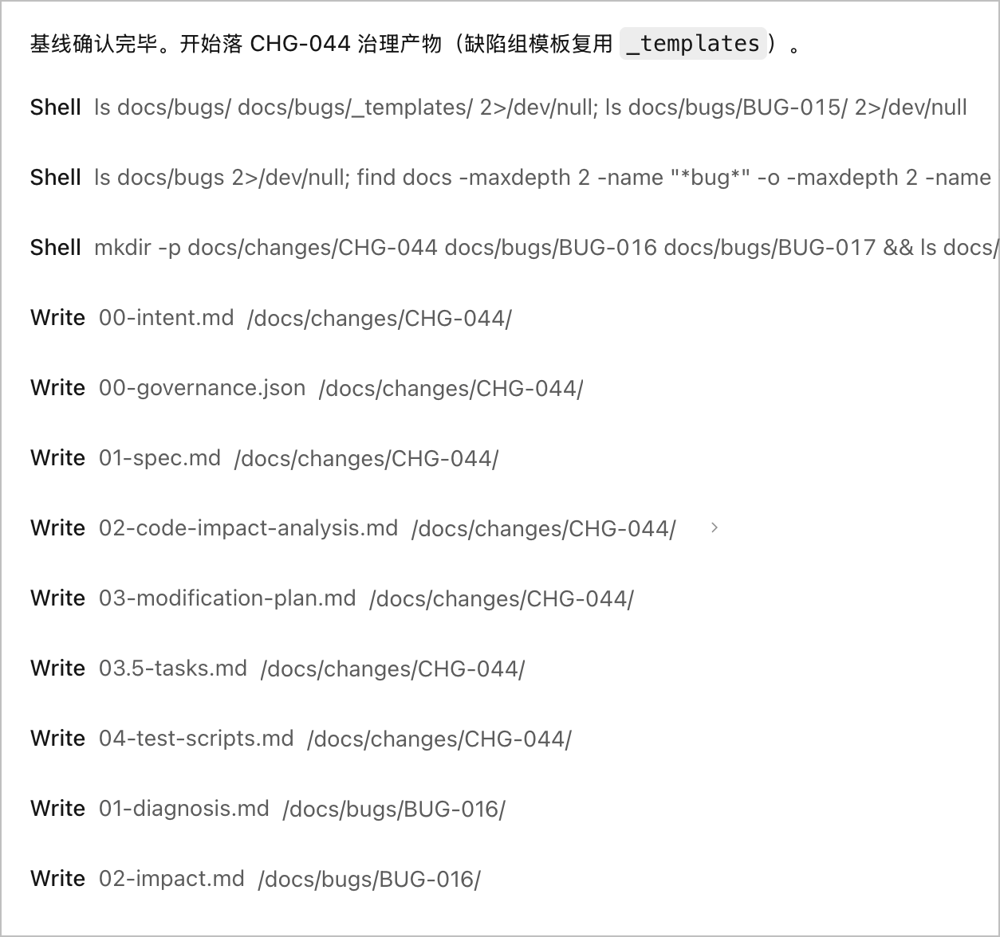
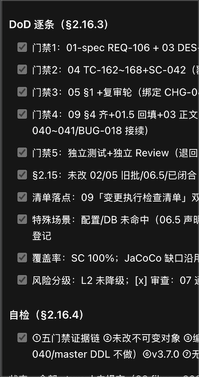
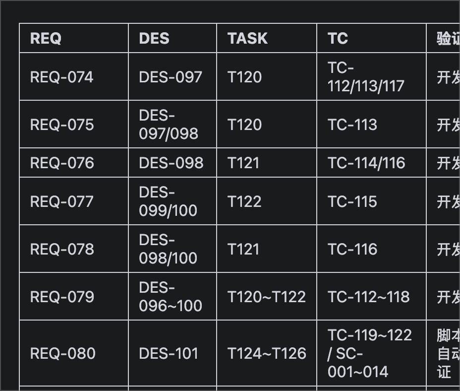
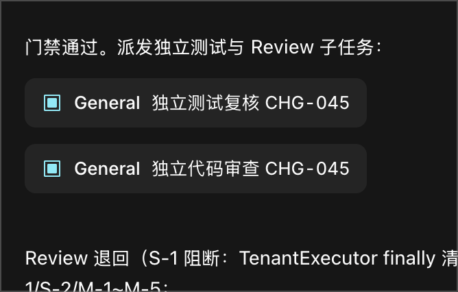

<!-- markdownlint-disable MD033 MD041 MD013 -->
<div align="center">

# dev-standards-bootstrap

### One-command AI Agent Development Governance & Quality Gate System for Any Repository

[](LICENSE)
[](resources/DEVELOPMENT_STANDARDS.md)
[](resources/AGENTS.md)
[](../../pulls)

[English](README.md) | [中文](README.zh-CN.md)

</div>

---

## Overview

**dev-standards-bootstrap** is a reusable AI agent Skill that injects a complete, battle-tested **software development and change management governance system** into any code repository with a single command.

`AGENTS.md` supplies a shared instruction layer to compatible agents. For enforcement, the optional guard package adds one deterministic validator that local hooks, Git hooks, and CI all invoke. This avoids duplicating policy logic while preserving CI as the trust boundary for every client.

### Why You Need This

When multiple AI agents work on the same codebase, chaos is inevitable without governance:

- Agents skip documentation and jump straight to code
- Tests are an afterthought-or missing entirely
- No traceability between requirements, design, code, and tests
- The same agent writes, tests, and approves its own work
- Silent step-skipping disguised as "summaries"
- Changes shipped without analyzing impact on other code, flows, or business

This Skill solves all of the above by installing **five mandatory quality gates**, a **risk classification matrix**, an **agent role independence framework**, and **anti-skip execution rules** into your repository-once, permanently.

### The Research Behind It

These failure modes are measured, not hypothetical. A CIKM '26 study of production agent memory ([arXiv:2608.22752](https://arxiv.org/abs/2608.22752)) shows Claude Code's production `/compact` prompt retains only **53% of safety rules after one compaction round, 10% after five**--agent memory silently loses the rules it was told to keep, and self-reported success diverges from what is actually on disk. The [AI-Native SDLC Playbook](https://claude.com/blog/the-ai-native-sdlc-playbook) documents the process side: intent drift in long sessions, decision paths no reviewer can follow, and incidents that never feed back into process.

This project's answer is architectural, not prompt-level: **never trust agent memory or self-reports**. Governance state lives on disk as versioned artifacts; a dependency-free gate reads the filesystem (not the conversation) at every write; CI is the final arbiter; and the governance package tests itself with 107 golden-case assertions.

---

## Key Features

| Feature | Description |
|---|---|
| **5 Quality Gates + Two-Layer Acceptance** | Doc-First, Test-First, Evidence, Traceability, and Independent Verification—non-bypassable; every stage passes machine-verifiable A-layer markers plus independent-role B-layer judgment (developers can never self-assess layer B, §2.5) |
| **Risk Classification × Agent Role Independence** | L0–L3 risk matrix drives independence requirements: roles must be separate execution entities, L2/L3 require distinct platform/model vendors (L3 ≥2), high-risk needs human Release Owner approval (§0.5) |
| **RTVM Traceability + One Change, One Document Set** | REQ→DES→TASK→TC full-chain matrix; every change opens a fresh `docs/changes/<new-id>/` group meeting the **eight-category** minimum document set (incl. `04.5-coding-record.md` enforced at stop/ci) and every defect a fresh six-file bug group linked via `bug_ref`—append-only, never edit a closed group (一次变更一组文档, §2.15) |
| **10-Stage Lifecycle + AI Anti-Skip Rules** | Requirements through memory sedimentation; ReAct (Thought→Action→Observation) on every step; anti-skip rules ban summary-style "done", silent downgrades, and premature completion (§2.16) |
| **Test Coverage Standard (11 dimensions)** | Happy path / business scenario / logic branch / boundary & null / exception & fallback (incl. fault injection, replay idempotency) / data combination / concurrency & race / security / compatibility / performance & capacity / regression—design per dimension or explicitly mark N/A; branch coverage ≥60% on new code (L2+); LLM eval-set regression; **business-scenario coverage ≥80%** (SC-xxx, L3 ≥90%) |
| **Methodology Selection Layer (M0–M3)** | `METHODOLOGY.md` answers "which methodologies are allowed / forbidden"; `methodologies/` provide per-item engineering rationale (weak-typing ban, LLM I/O schema separation, state-trigger audit) |
| **Bug Fix Log + Same-Family Scan** | Repo-level append-only `bugfix-log.md` index; root-cause tables carry a **same-family** scan row ("which other paths share this root-cause pattern?")—fix without family scan is rejected (§2.5 Stage 6) |
| **Deterministic Agent Gate + CI/PR Guardrails** | One dependency-free validator shared by write-time hooks, Git hooks, and CI; client adapter generator for Claude Code/Cursor/Gemini CLI; Git hooks + CI workflow cover every other client (they validate the repo, not the editor) |
| **Intent Layer + Pipeline Automation** | Every change starts from a recorded `00-intent.md` (rejected at `begin` without it); merging `01-spec.md` auto-dispatches impact/plan/test skeletons, merging `09-changelog.md` auto-opens a release checklist; incidents auto-create `BUG-<ts>` intent PRs; autonomy capped at A2 (skeletons only, never content or merge) |
| **Pipeline Metrics** | `agent-gate metrics` emits JSON Lines (stage timestamps, intervals, `delivery_ready`) purely from git history—observation only, never a substitute for DoD (§2.17.5) |
| **Golden-Case Self-Tests** | `tests/run-tests.sh` regression-tests the gate and the `scripts/bootstrap.sh` installer (107 assertions) in throwaway git repos—bash + git only (§2.17.4) |
| **Specialized Standards** | Coverage for deployment, config, DB changes, AI/LLM pipelines, test data isolation, emergency hotfixes, release, monitoring, and supply chain |

---

## Supported AI Coding Tools

`AGENTS.md` is a context mechanism, not an enforcement mechanism. Support and loading semantics vary by client and version; validate each tool in your environment. The final cross-client control is protected branches plus required CI checks.

| Tool | Status |
|---|---|
| Claude Code | Natively reads `AGENTS.md` |
| Cursor | Natively reads `AGENTS.md` |
| Codex (OpenAI) | Natively reads `AGENTS.md` |
| Windsurf | Natively reads `AGENTS.md` |
| Gemini CLI | Natively reads `AGENTS.md` |
| Qoder | Natively reads `AGENTS.md` |
| Trae | Natively reads `AGENTS.md` |
| OpenCode | Natively reads `AGENTS.md` |

> Use `AGENTS.md` for shared context. Install the optional hook adapters only where their pre-write behavior is required.

---

## Quick Start

### Install the Skill

Clone the repository into your personal or organizational Skill directory:

```bash
git clone https://github.com/geekma/dev-standards-bootstrap.git
```

Or add it as a submodule to your Skill collection:

```bash
git submodule add https://github.com/geekma/dev-standards-bootstrap.git
```

### Bootstrap a Repository

Open your AI coding tool (e.g., Claude Code) in any target repository and say:

> "Use dev-standards-bootstrap to initialize this repo."

The Skill will:

1. Detect existing files and avoid overwriting (shows diffs first)
2. Write `AGENTS.md` to the repo root
3. Write `DEVELOPMENT_STANDARDS.md`, `METHODOLOGY.md`, `methodologies/`, `bugfix-log.md`, the six-file bug template set (`docs/bugs/_templates/`), and the generic cross-doc audit script (`tests/audit-docs-consistency.sh`) to `docs/` and `tests/`
4. Optionally add Claude Code one-line import (`CLAUDE.md`)
5. Optionally add PR template and CI compliance script
6. Optionally add the deterministic gate, Git hooks, CI workflow, governance config record, tool-specific hook adapters, and the golden-case self-test suite
7. Optionally install pipeline automation: the intent template, artifact-pipeline workflow, and incident-to-intent workflow
8. Optionally scaffold the first feature directory under `docs/<feature>/`

---

## Repository Structure

```
dev-standards-bootstrap/
├── SKILL.md                                # Skill manifest (trigger, execution steps, red lines)
├── README.md                               # English documentation (this file)
├── README.zh-CN.md                         # Chinese documentation
├── LICENSE                                 # MIT License
├── scripts/
│   └── bootstrap.sh                        # Manifest-driven installer (not shipped): copies resources/ into a target repo by layer (--core/--claude/--ci/--guard/--pipeline), idempotent, conflict-safe
├── screenshots/                            # README screenshots (gate blocking, change artifacts)
├── tests/
│   ├── run-tests.sh                        # Golden-case regression suite for governance templates incl. gate & bootstrap (107 assertions; copied to target tests/ — target-repo adaptive: unshipped/skipped cases auto-skip)
│   └── audit-standards-src.sh              # Source-layer only (NOT shipped): audits the standards text itself - version chain / keyword matrix / checklist sync / numbering / tautology-proof greps
└── resources/
    ├── AGENTS.md                           # Entry point for AI agents (copied to target repo root)
    ├── DEVELOPMENT_STANDARDS.md             # Full standards document v3.7.0 (copied to docs/)
    ├── METHODOLOGY.md                       # Methodology selection guide: M0-M3 levels + stage x methodology x applicable / not-applicable table (copied to docs/)
    ├── methodologies/
    │   ├── development.md                   # Code standards: SOLID/DRY/KISS/YAGNI applicability & exemptions + 7 engineering dimensions
    │   ├── data-structures.md               # Data structure standards: 6 model types + weak-typing ban + LLM input/output specifics
    │   └── state-trigger-audit.md           # State/trigger-link audit: 6 lessons + 6-step checklist + 3 anti-patterns (v3.4.0)
    └── templates/
        ├── CLAUDE.md                       # One-line import for Claude Code
        ├── PULL_REQUEST_TEMPLATE.md        # GitHub PR template with gate self-check
        ├── check-standards-compliance.sh   # CI compliance check script
        ├── agent-gate.sh                   # Shared pre-write / commit-msg / Git / CI validator (+ metrics)
        ├── intent.md                       # Pipeline entry template for each change's 00-intent.md
        ├── bugfix-log.md                   # Repo-level bug-fix index template (copied to docs/bugfix-log.md)
        ├── audit-docs-consistency.sh       # Cross-doc consistency audit: version chain / numbering continuity / checklist sync / bugfix cross-registration / RTVM backfill (copied to tests/)
        ├── governance-state.json           # Template for each change's 00-governance.json (risk level + execution owners)
        ├── agent-governance.yml            # Team-reviewable governance config record (copied to .agent-governance.yml)
        ├── pre-commit, pre-push, commit-msg  # Git hook templates (commit-msg: attribution gate)
        ├── install-hook-adapter.sh         # Generates the hook adapter for the detected tool (claude/cursor/gemini)
        ├── github-agent-governance.yml     # Required-check workflow template
        ├── github-artifact-pipeline.yml    # Artifact pipeline: spec merged -> 02/03/03.5/04 skeletons PR; changelog merged -> release checklist issue
        └── github-incident-to-intent.yml   # Incident loop: alert dispatch -> BUG-<ts> intent skeleton PR
```

### Optional Enforcement Package

Copy `agent-gate.sh` to `scripts/agent-gate` and make it executable. Before an agent writes source code, create `docs/changes/CHG-123/` with a completed `00-intent.md` (recorded intent: problem / expected outcome / constraints) and `00-governance.json`, plus non-empty `01-spec.md`, `02-code-impact-analysis.md`, `03-modification-plan.md`, `03.5-tasks.md`, and `04-test-scripts.md`, then run:

```bash
scripts/agent-gate begin CHG-123
```

The gate is one dependency-free Bash script; every adapter reuses the same command surface:

| Command | Purpose |
|---|---|
| `begin <change-id>` / `end` | Activate or clear the active change; `begin` requires the seven change artifacts (including `00-intent.md`, the `02` impact analysis, and the `03.5` task breakdown) to exist and be non-empty, and validates the governance state plus A-layer content markers |
| `--stage pre-write` | Validates the active change's artifacts and governance state before an agent writes source code; fails closed if the target path cannot be parsed from hook input |
| `--stage staged` | Staged source changes must ship with matching change artifacts and a valid governance state, otherwise the commit is rejected |
| `--stage commit-msg <msgfile>` | Attribution gate: a commit that stages code files must reference a valid change id (waived for merge / revert / docs-only commits) |
| `--stage stop` | Ending a turn after source edits requires `04.5-coding-record.md` (coding record, new in v3.7.0, checked first), `05-test-results.md`, `09-changelog.md` (with ReAct Observation records, §2.16.2), plus a passing `AGENT_GUARD_VERIFY_COMMAND` when configured; REQ ids referenced by the changelog must be backfilled as rows in `docs/<feature>/01.5-rtvm-matrix.md` (Gate 4 RTVM closure, v3.7.0; exempt when no REQ references) |
| `--stage ci [--base <ref>]` | Rechecks the branch/PR diff (artifacts + governance state + delivery evidence for touched changes) and runs the real verification command |
| `metrics` | Read-only pipeline metrics as JSON Lines: per-stage timestamps, stage intervals, `delivery_ready`-observations only, never a substitute for DoD |

What the required artifact set looks like on disk for a fresh change (screenshot from an earlier version; the current gate additionally requires `02-code-impact-analysis.md` and `03.5-tasks.md`):


The same set being produced by an agent in a real session--the current full change group (including `02-code-impact-analysis.md` and `03.5-tasks.md`) plus the companion defect groups under `docs/bugs/`, all landed before any source edit (Gate 1 Doc-First, §2.15 one-change-one-document-set):



Copy `agent-governance.yml` to the repo root as `.agent-governance.yml`-a team-reviewable record of the required artifacts and the verification command. Set `AGENT_GUARD_CHANGE_ROOT` to relocate the default `docs/changes` root.

Run `scripts/install-hook-adapter` to generate the hook adapter for the client in use-auto-detected from `CLAUDECODE` / `CURSOR_AGENT` / `GEMINI_CLI`, or passed as `claude|cursor|gemini`. All client schemas live in that one generator; there are no per-tool JSON files to maintain, and an existing config with different content is never overwritten silently (diff shown, `--force` to override). Clients without a known hook schema (Codex, Windsurf, Qoder, Trae, OpenCode) get no fabricated config: their enforcement path is the Git hooks and CI workflow, which validate the repository rather than the editor.

The structured state records risk and responsible execution identities; for L2/L3, implementation, test, and review owners must differ. Placeholder owner values (`PENDING`/`TODO`/`TBD`) are rejected, and L3 additionally requires the three release-authorization fields `release_authorized_by`/`release_authorized_at`/`release_authorization_evidence`. Tool `PreToolUse` hooks block supported agents before a source edit, while `Stop` hooks block an agent from ending after source edits until test evidence and a changelog exist. Git hooks reject a non-compliant local commit, and the GitHub workflow rechecks the pull request. Install Git hooks with `git config core.hooksPath .githooks`, set the repository variable `AGENT_GUARD_VERIFY_COMMAND` to the real build/lint/test/security command, then mark the workflow as a required branch-protection check. State files and checkboxes are declarations, not proof: CI re-runs the real command and is mandatory for enforcement.

The gate blocking in practice--a commit of source changes without matching change artifacts is rejected right in the IDE:


The compliant counterpart--before a turn may end, the agent walks the DoD item by item (§2.16.3, every row bound to concrete artifact ids) and runs the seven-point self-check (§2.16.4); a summary-style "done" never passes the stop gate:



### Optional Pipeline Automation (§2.17)

Hosted-platform layer, independent of any coding client:

- **Artifact pipeline** (`github-artifact-pipeline.yml`): merging `01-spec.md` into main auto-creates an `automation/<change-id>-scaffold` branch with `02`/`03`/`03.5`/`04` skeletons and a PR; merging `09-changelog.md` auto-opens a release-checklist issue. Skeletons contain headings and to-fill comments only-no fabricated content; all gates still apply before merge.
- **Incident loop** (`github-incident-to-intent.yml`): monitoring systems fire `repository_dispatch` with type `incident` (a one-line `curl` with alert metadata); the workflow creates a `BUG-<UTC-timestamp>` change with an intent skeleton PR. Every incident re-enters the pipeline as recorded intent-no silent fixes. Skips if the branch already exists (alert-storm protection).
- **Autonomy cap**: hosted workflows are limited to A2 actions (branches, skeletons, PRs, issues). Content (A3) and execution (A4) stay local; merge gates are never waived by automation.
- **Portability**: the reference implementation uses GitHub Actions; GitLab and other platforms implement the same semantics with their CI rules + API (notes in each workflow's header). Semantics are defined by the standards §2.17, not by any platform.
- **Self-testing**: before modifying `agent-gate.sh`, hooks, or workflows, run `bash tests/run-tests.sh`-107 golden-case assertions in throwaway git repos; requires only bash and git (macOS/Linux, any IDE terminal).

---

## The Five Quality Gates

A change passing through the gates accumulates its full artifact chain, from `01-spec.md` all the way to `08-supplement.md`:


```
[ Gate 1: Doc-First ]      Requirements/design must exist before any code change
        │
        ▼
[ Gate 2: Test-First ]     Test cases (TDD red-green) must exist before implementation
        │
        ▼
[ Gate 3: Evidence ]       Real test output required-no verbal claims of "done"
        │
        ▼
[ Gate 4: Traceability ]   RTVM must be closed: REQ ↔ DES ↔ CODE ↔ TC
        │
        ▼
[ Gate 5: Independent ]    Test & review by different agents/humans; high-risk needs human approval
```

Any change that fails any gate is **blocked from merge to main**.

Gate 4 in practice: the traceability matrix is not an illustration but a real file--`docs/<feature>/01.5-rtvm-matrix.md` closes the loop row by row, each REQ traced through DES → TASK → TC with an explicit verification status:



Gate 5 in practice:blocked from merge to main**.

Gate 5 in practice: once the machine gates pass, independent test-review and code-review subtasks are dispatched to separate agents (role independence, §0.5)--and an independent review genuinely rejects work: here the change came back with an S-1 blocker plus S-2/M-1~M-5 findings instead of a rubber stamp:



---

## Risk Classification Matrix

| Level | Criteria | Independence | Cross-Platform | Human Approval |
|---|---|---|---|---|
| **L0** Very Low | No logic change (docs, comments, formatting) | Roles may merge | Not required | No |
| **L1** Low | Non-core modules, no external interfaces | Separate sub-tasks | Not required | No |
| **L2** Medium (default) | Core business logic, P0/P1 priority | Separate execution entities | Recommended | No |
| **L3** High | Sensitive personal data (PII), auth, prod DB, AI/Prompt, breaking API changes, P0 hotfix | Mandatory cross-platform/cross-model | **Mandatory** (≥2 model vendors) | **Mandatory** |

---

## Contributing

Contributions are welcome! Please follow the standards defined in this repository when submitting changes:

1. Ensure documentation is updated before code changes (Gate 1)
2. Write tests first (Gate 2)
3. Provide real test output (Gate 3)
4. Close the RTVM (Gate 4)
5. Ensure independent review (Gate 5)

Pull requests should use the [PR template](resources/templates/PULL_REQUEST_TEMPLATE.md) and complete all gate self-checks.

---

## License

This project is licensed under the [MIT License](LICENSE).

---

<div align="center">

**Standards Version:** v3.7.0 | **Last Updated:** 2026-09-09 | **Maintainer:** [geekma](https://x.com/geekma) | **Email:** geekma@gmail.com

[Report Bug](../../issues) | [Request Feature](../../issues) | [Read the Standards](resources/DEVELOPMENT_STANDARDS.md)

</div>
