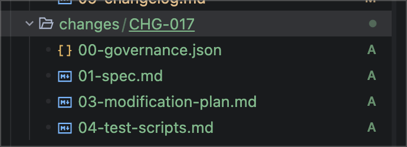
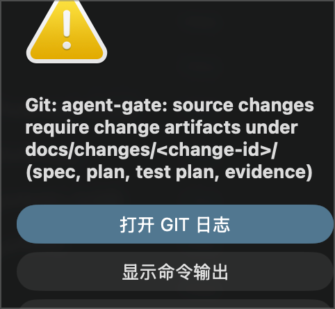
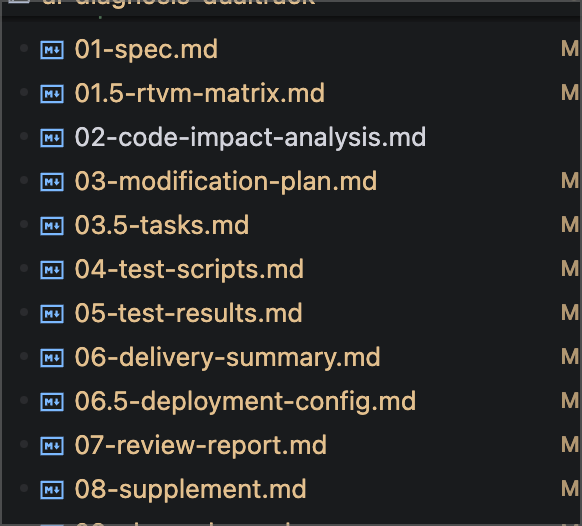

<!-- markdownlint-disable MD033 MD041 MD013 -->
<div align="center">

# dev-standards-bootstrap

### 一键为任意代码仓库注入 AI Agent 开发治理与质量门禁体系

[](LICENSE)
[](resources/DEVELOPMENT_STANDARDS.md)
[](resources/AGENTS.md)
[](../../pulls)

[English](README.md) | [中文](README.zh-CN.md)

</div>

---

## 项目简介

**dev-standards-bootstrap** 是一个可复用的 AI Agent Skill，能够用一条指令将一套完整的、经过实战打磨的**软件开发与变更治理规范体系**注入到任意代码仓库中。

`AGENTS.md` 为兼容的 Agent 提供统一指令层。若要强制执行，可选强制执行包会增加一个确定性校验器，由本地 Hook、Git Hook 与 CI 共同调用；规范逻辑不重复，CI 则保留为所有客户端共同的信任边界。

### 为什么需要它

当多个 AI Agent 同时在同一个代码仓库中工作时，如果没有治理机制，混乱不可避免：

- Agent 跳过文档直接改代码
- 测试是事后补的--或者根本没有
- 需求、设计、代码、测试之间没有可追溯性
- 同一个 Agent 自己写代码、自己测试、自己审批
- 用"总结"代替逐项核对，悄悄跳过步骤
- 不分析对其他代码、流程、业务的影响就直接动手改

本 Skill 通过安装**五道强制门禁**、**风险分级矩阵**、**Agent 角色独立性框架**和**防遗漏防跳过执行规则**，彻底解决上述问题--一次安装，永久生效。

### 背后的研究依据

这些失败模式是被测量过的，不是假设。CIKM '26 对生产级 Agent 记忆的研究（[arXiv:2608.22752](https://arxiv.org/abs/2608.22752)）表明：Claude Code 的生产 `/compact` 提示词一轮压缩后安全规则仅存 **53%，五轮后 10%**--Agent 记忆会静默丢失被要求保留的规则，且「自我报告成功」与磁盘实态背离。[AI 原生 SDLC Playbook](https://claude.com/blog/the-ai-native-sdlc-playbook) 则记录了流程侧的问题：长会话意图漂移、无人能复盘的决策路径、不回流流程的事故。

本项目的答案是架构级而非提示词级：**从不信任 Agent 记忆与自我报告**。治理状态以版本化产物落盘；零依赖门禁在每次写入时读的是文件系统（而非对话）；CI 是最终仲裁者；治理包自身通过 46 项 golden-case 断言自测试。

---

## 核心特性

| 特性 | 说明 |
|---|---|
| **五道质量门禁** | 文档先行、测试先行、完工证据、全链路追踪矩阵、独立验证--不可绕过 |
| **风险分级（L0–L3）** | 决定 Agent 独立性要求和跨平台/跨模型厂商验证规则 |
| **Agent 角色独立性** | 编排者、需求、架构/计划、开发、测试、Review 角色必须是不同的执行主体 |
| **四维追踪矩阵（RTVM）** | 需求（REQ）-> 设计（DES）-> 任务（TASK）-> 测试用例（TC）全链路追溯 |
| **10 阶段开发生命周期** | 从需求定义到记忆沉淀与持续改进 |
| **AI 防漏防跳过规则** | 专门约束 AI Agent 静默跳步、用摘要代替逐项清单、提前标记完成等行为 |
| **两层验收标准（A/B）** | 每个阶段产物须过机器可验标记（A 层：编号体系/必含节）+ 独立角色判定（B 层）——开发 Agent 不得自评 B 层（§2.5） |
| **专业角色标准** | 变更前背景调研；方案前业务/技术/风险三维影响分析；≥2 候选选型对比；PM 标准任务拆分（关键路径/里程碑/DoT）；九类测试覆盖维度、禁止静默裁剪 |
| **ReAct 执行铁律** | 每步与每次改码均按 Thought → Action → Observation 推进；未经全局影响分析直接动手属严重违规（§2.16.2） |
| **CI/PR 工程化兜底** | GitHub PR 模板和 Bash 合规检查脚本，CI 流水线自动拦截 |
| **确定性 Agent 门禁** | 一套零第三方依赖校验器，供写前 Hook、Git Hook 与 CI 共同调用 |
| **客户端适配层** | 一个生成器按当前工具自动生成 Claude Code / Cursor / Gemini CLI 的 Hook 配置，其余客户端由 Git Hook + CI 兜底 |
| **意图层（`00-intent.md`）** | 每个变更从记录意图开始（问题 / 预期结果 / 约束）；无意图变更在 `begin` 即被拒绝（§2.17） |
| **变更管线传动机制** | `01-spec.md` 合入自动派发影响分析/方案/测试骨架 PR；`09-changelog.md` 合入自动开发布检查单 issue--只派骨架，不臆造内容 |
| **事故重入闭环** | 生产告警经 `repository_dispatch` 自动创建 `BUG-<时间戳>` 意图骨架 PR；禁止“修完不留痕” |
| **管线度量** | `agent-gate metrics` 输出 JSON Lines：各阶段时间戳、阶段间隔、`delivery_ready`--纯 git 历史推导，零依赖 |
| **A0–A4 自主权矩阵** | 自动化动作按环境分级授权；托管 workflow 上限 A2（骨架 + PR），合入门禁不因自动化豁免 |
| **Golden-Case 自测试** | `tests/run-tests.sh` 用临时 git 仓库对门禁自身做回归测试（46 项断言），仅需 bash + git |
| **专项规范** | 覆盖部署、配置/数据库变更、AI/LLM 链路、测试数据隔离、紧急热修复、发布上线、监控告警、供应链依赖管理 |

---

## 支持的 AI 编程工具

`AGENTS.md` 是上下文机制，而非强制执行机制。各工具对其支持与加载行为会随版本不同，须在组织环境中验证；真正跨客户端的最终控制点是受保护分支和 Required CI Check。

| 工具 | 状态 |
|---|---|
| Claude Code | 原生读取 `AGENTS.md` |
| Cursor | 原生读取 `AGENTS.md` |
| Codex (OpenAI) | 原生读取 `AGENTS.md` |
| Windsurf | 原生读取 `AGENTS.md` |
| Gemini CLI | 原生读取 `AGENTS.md` |
| Qoder | 原生读取 `AGENTS.md` |
| Trae | 原生读取 `AGENTS.md` |
| OpenCode | 原生读取 `AGENTS.md` |

> 用 `AGENTS.md` 统一上下文；只有需要写前拦截的客户端才安装相应 Hook 适配器。

---

## 快速开始

### 安装 Skill

将仓库克隆到你的个人或组织 Skill 目录中：

```bash
git clone https://github.com/geekma/dev-standards-bootstrap.git
```

或者作为子模块添加到你的 Skill 集合中：

```bash
git submodule add https://github.com/geekma/dev-standards-bootstrap.git
```

### 初始化仓库

在任意目标仓库中打开你的 AI 编程工具（如 Claude Code），输入：

> "用 dev-standards-bootstrap 初始化这个仓库。"

Skill 将自动执行：

1. 检测已有文件，避免覆盖（先展示差异再询问）
2. 将 `AGENTS.md` 写入仓库根目录
3. 将 `DEVELOPMENT_STANDARDS.md` 写入 `docs/` 目录
4. 可选：为 Claude Code 添加一行导入文件（`CLAUDE.md`）
5. 可选：添加 PR 模板和 CI 合规检查脚本
6. 可选：添加确定性门禁、Git Hook、CI workflow、治理配置记录与 Hook 适配器生成器
7. 可选：安装管线自动化--意图模板、变更管线 workflow、事故闭环 workflow 与 Golden-Case 测试套件
8. 可选：在 `docs/<feature>/` 下创建第一个功能目录骨架

---

## 仓库结构

```ini
dev-standards-bootstrap/
├── SKILL.md                                # Skill 清单（触发条件、执行步骤、红线）
├── README.md                               # 英文文档
├── README.zh-CN.md                         # 中文文档（本文件）
├── LICENSE                                 # MIT 开源协议
├── screenshots/                            # README 截图（门禁拦截、变更产物）
├── tests/
│   └── run-tests.sh                        # 门禁自身的 Golden-Case 回归套件（46 项断言）
└── resources/
    ├── AGENTS.md                           # AI Agent 入口文件（复制到目标仓库根目录）
    ├── DEVELOPMENT_STANDARDS.md             # 完整规范文档 v2.22.0（复制到 docs/）
    └── templates/
        ├── CLAUDE.md                       # Claude Code 一行导入文件
        ├── PULL_REQUEST_TEMPLATE.md        # GitHub PR 模板（含门禁自查）
        ├── check-standards-compliance.sh   # CI 合规检查脚本
        ├── agent-gate.sh                   # 共享写前 / Git / CI 校验器（含 metrics）
        ├── intent.md                       # 每个变更 00-intent.md 的管线入口模板
        ├── governance-state.json           # 每个变更 00-governance.json 的模板（风险等级与执行主体）
        ├── agent-governance.yml            # 团队可审阅的治理配置记录（复制为 .agent-governance.yml）
        ├── pre-commit、pre-push            # Git Hook 模板
        ├── install-hook-adapter.sh         # 按检测到的工具生成 Hook 适配器（claude/cursor/gemini）
        ├── github-agent-governance.yml     # Required Check workflow 模板
        ├── github-artifact-pipeline.yml    # 变更管线：spec 合入 -> 02/03/04 骨架 PR；changelog 合入 -> 发布检查单 issue
        └── github-incident-to-intent.yml   # 事故闭环：告警 dispatch -> BUG-<时间戳> 意图骨架 PR
```

### 可选强制执行包

将 `agent-gate.sh` 复制为 `scripts/agent-gate` 并赋予可执行权限。Agent 首次写入源码前，必须先创建已填写的 `docs/changes/CHG-123/00-intent.md`（记录意图：问题 / 预期结果 / 约束）与 `00-governance.json`，以及非空的 `01-spec.md`、`02-code-impact-analysis.md`、`03-modification-plan.md`、`03.5-tasks.md`、`04-test-scripts.md`，再执行：

```bash
scripts/agent-gate begin CHG-123
```

门禁是一个零依赖的 Bash 脚本，所有适配器共用同一套命令面：

| 命令 | 作用 |
|---|---|
| `begin <变更号>` / `end` | 激活或清除活跃变更；`begin` 要求七份变更产物（含 `00-intent.md`、`02` 影响分析与 `03.5` 任务拆解）已存在且非空，并校验治理状态与 A 层内容标记 |
| `--stage pre-write` | Agent 写源码前校验活跃变更的产物与治理状态；无法从 Hook 入参解析目标路径时按失败处理（fail-closed） |
| `--stage staged` | 已暂存的源码变更必须携带对应变更产物，否则拒绝提交 |
| `--stage stop` | 源码改动后结束回复，必须具备 `05-test-results.md` 与 `09-changelog.md`（含 ReAct Observation 记录，§2.16.2）；配置了 `AGENT_GUARD_VERIFY_COMMAND` 时还须通过该命令 |
| `--stage ci [--base <ref>]` | 在分支/PR 差异上重新校验，并执行真实的验证命令 |
| `metrics` | 只读输出管线度量（JSON Lines）：各阶段时间戳、阶段间隔、`delivery_ready`--仅作观察，不替代 DoD 判定 |

新变更的必要产物集在磁盘上的样子（截图为较早版本；当前门禁另要求 `02-code-impact-analysis.md` 与 `03.5-tasks.md`）：



将 `agent-governance.yml` 复制为仓库根目录的 `.agent-governance.yml`，作为团队可审阅的治理配置记录；设置 `AGENT_GUARD_CHANGE_ROOT` 可重定位默认的 `docs/changes` 根目录。

执行 `scripts/install-hook-adapter` 可为当前客户端生成 Hook 适配器--通过 `CLAUDECODE` / `CURSOR_AGENT` / `GEMINI_CLI` 自动检测，或显式传入 `claude|cursor|gemini`。所有客户端 schema 都内嵌在这一个生成器里，不再维护每工具一份 JSON；目标文件已存在且内容不同时会展示 diff 并拒绝静默覆盖（`--force` 可覆盖）。没有已知 Hook schema 的客户端（Codex、Windsurf、Qoder、Trae、OpenCode）不会得到臆造的配置：它们的强制执行路径是 Git Hook 与 CI workflow--二者校验的是仓库而非编辑器。

结构化状态会记录风险和执行主体；L2/L3 的开发、测试、Review 主体必须不同。工具的 `PreToolUse` Hook 会在受支持 Agent 写源码前阻断；`Stop` Hook 会在源码已变更但测试证据或 Changelog 缺失时阻止 Agent 结束回复；Git Hook 会拒绝不合规的本地提交；GitHub workflow 会在 PR 上重新校验。用 `git config core.hooksPath .githooks` 安装 Git Hook，在仓库变量 `AGENT_GUARD_VERIFY_COMMAND` 中设置真实构建/lint/测试/安全命令，最后把 workflow 设为分支保护 Required Check。状态文件与复选框只是声明，不是证据：CI 会重新执行真实命令，必须启用 Required CI 才能强制执行。

门禁的实际拦截效果--在 IDE 中提交缺少变更产物的源码改动会被当场拒绝：



### 可选管线自动化（§2.17）

托管平台层，与编程客户端无关：

- **变更管线**（`github-artifact-pipeline.yml`）：`01-spec.md` 合入主干自动创建 `automation/<变更ID>-scaffold` 分支、派发 `02`/`03`/`04` 骨架并开 PR；`09-changelog.md` 合入自动开发布检查单 issue。骨架只含标题与待填注释，不臆造内容；合入前全部门禁照常生效。
- **事故闭环**（`github-incident-to-intent.yml`）：监控系统调用 `repository_dispatch`（类型 `incident`，一行 `curl` 附带告警元数据）；workflow 自动创建 `BUG-<UTC 时间戳>` 变更与意图骨架 PR。任何事故都以记录意图重入管线，禁止“修完不留痕”；分支已存在即跳过（防告警风暴）。
- **自主权上限**：托管 workflow 上限 A2（分支、骨架、PR、issue）；A3（内容）/A4（执行）仅在本地，合入门禁不因自动化豁免。
- **平台可移植**：参考实现为 GitHub Actions；GitLab 等平台用其 CI 规则 + 平台 API 实现同一语义（各 workflow 头部注释有思路）。语义以规范 §2.17 为准，不绑定平台。
- **自测试**：修改 `agent-gate.sh`、Hook 或 workflow 前，先跑 `bash tests/run-tests.sh`--46 项 Golden-Case 断言在临时 git 仓库中执行，仅需 bash 与 git（macOS/Linux、任意 IDE 终端）。

---

## 五道质量门禁

变更通过五道门禁的过程会沉淀完整产物链，从 `01-spec.md` 一路演进到 `08-supplement.md`：



```ini
[ 门禁 1：文档先行 ]      需求/设计必须先于代码变更存在
        │
        ▼
[ 门禁 2：测试先行 ]      测试用例（TDD 红绿循环）必须先于实现代码
        │
        ▼
[ 门禁 3：完工证据 ]      必须有真实测试输出--禁止口头声明"已完成"
        │
        ▼
[ 门禁 4：追踪矩阵 ]      RTVM 必须闭环：REQ ↔ DES ↔ CODE ↔ TC
        │
        ▼
[ 门禁 5：独立验证 ]      测试与审查由不同角色完成；高风险需人类授权
```

任何未通过门禁的变更，**一律禁止合入主分支**。

---

## 风险分级矩阵

| 等级 | 判定依据 | 角色独立性 | 跨平台要求 | 人类审批 |
|---|---|---|---|---|
| **L0** 极低 | 无逻辑变更（文档、注释、格式化） | 角色可合并 | 不要求 | 不需要 |
| **L1** 低 | 非核心模块，不涉及对外接口 | 独立子任务 | 不要求 | 不需要 |
| **L2** 中（默认） | 核心业务逻辑，P0/P1 优先级 | 独立执行主体 | 建议 | 不需要 |
| **L3** 高 | 敏感用户数据（PII）、认证授权、生产 DB、模型/Prompt、对外接口破坏性变更、P0 热修复 | 强制跨平台/跨模型 | **强制**（≥2 个模型厂商） | **强制** |

---

## 贡献指南

欢迎贡献代码！提交变更时请遵守本仓库定义的规范：

1. 确保文档先于代码变更更新（门禁 1）
2. 测试先行（门禁 2）
3. 提供真实测试输出（门禁 3）
4. 闭环追踪矩阵 RTVM（门禁 4）
5. 确保独立审查（门禁 5）

Pull Request 请使用 [PR 模板](resources/templates/PULL_REQUEST_TEMPLATE.md) 并完成全部门禁自查。

---

## 开源协议

本项目基于 [MIT 协议](LICENSE) 开源。

---

<div align="center">

**规范版本：** v2.22.0 | **更新时间：** 2026-09-04 | **维护者：** [geekma](https://x.com/geekma) | **邮箱：** geekma@gmail.com

[报告 Bug](../../issues) | [功能需求](../../issues) | [阅读规范全文](resources/DEVELOPMENT_STANDARDS.md)

</div>
